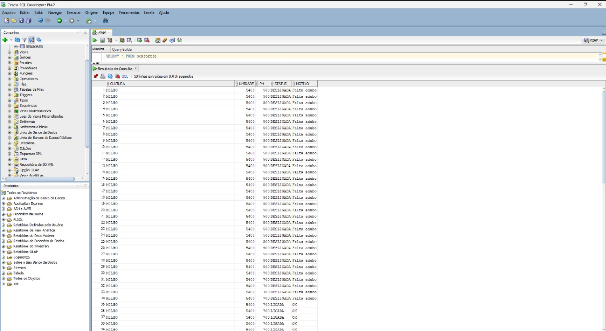
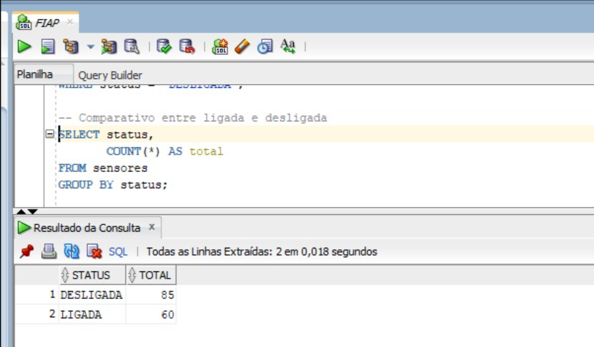
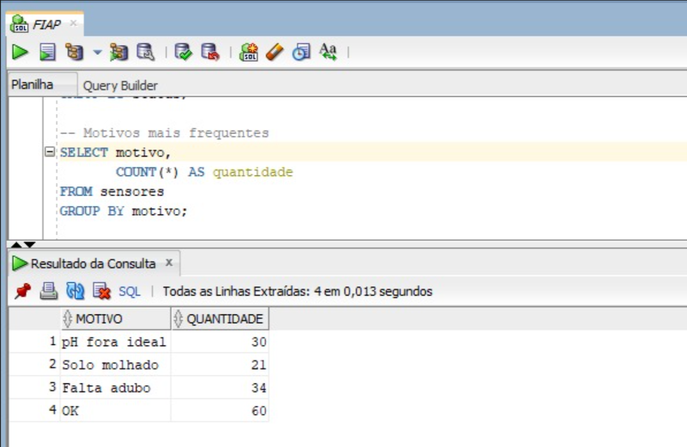
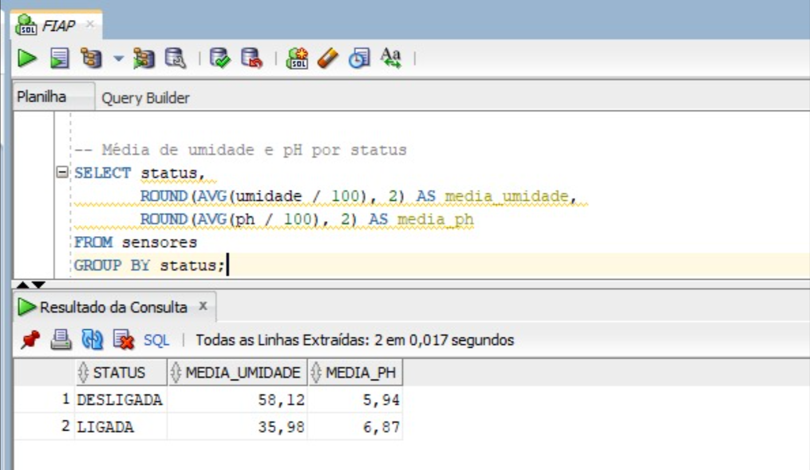
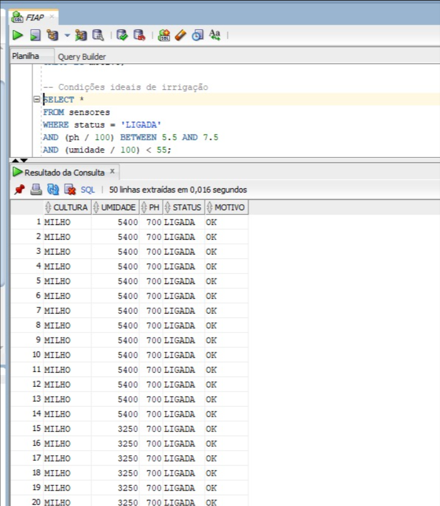
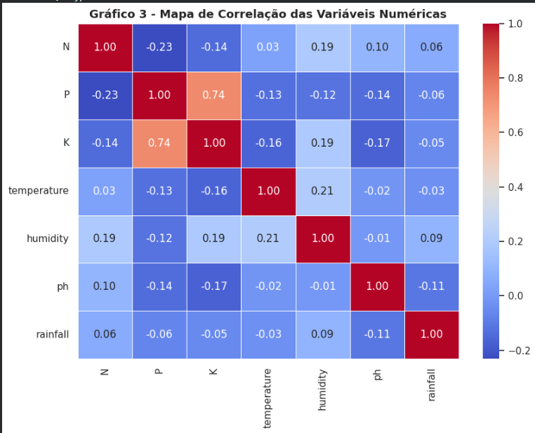
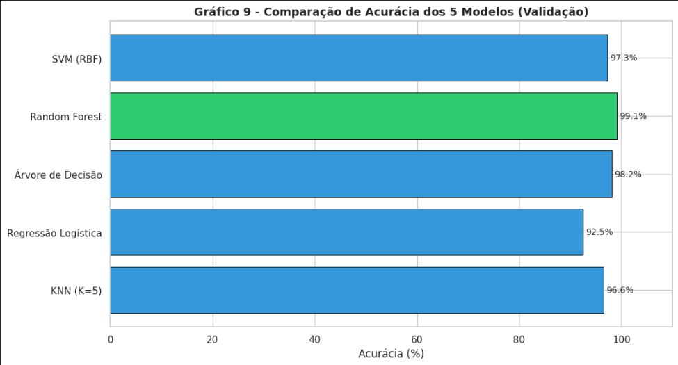
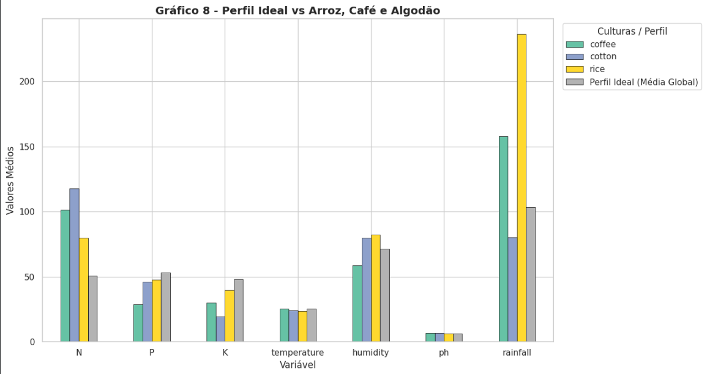

# Fase 3 - Cap1 - Etapas de uma Máquina Agrícola

# FIAP - Faculdade de Informática e Administração Paulista

<p align="center">
<a href= "https://www.fiap.com.br/"></a>
</p>

<br>

# 🌱 FarmTech Solutions

## Nome do grupo

## 👨‍🎓 Integrantes: 
- <a href="https://www.linkedin.com/company/inova-fusca">Arthur Prudêncio Soares — RM569295</a>
- <a href="https://www.linkedin.com/company/inova-fusca">Caroline Coelho Mendes — RM570370</a>
- <a href="https://www.linkedin.com/company/inova-fusca">Leandro Paiva — RM572159</a> 
- <a href="https://www.linkedin.com/company/inova-fusca">Lucas Viana de Lima — RM571835</a> 
- <a href="https://www.linkedin.com/company/inova-fusca">Matheus Tavares Lima — RM572808</a>

## 👩‍🏫 Professores:
### Tutor(a) 
- <a href="https://www.linkedin.com/company/inova-fusca">Nome do Tutor</a>
### Coordenador(a)
- <a href="https://www.linkedin.com/company/inova-fusca">Nome do Coordenador</a>


## 📜 Descrição

🌱 FarmTech Solutions - Fase 3: Cap 1 - Etapas de uma Máquina Agrícola

Este projeto compõe a Fase 3 do sistema de gestão agrícola da FarmTech Solutions, desenvolvido para a FIAP.

O objetivo do sistema é realizar o monitoramento inteligente de variáveis agrícolas importantes para o cultivo do milho, utilizando um ESP32 simulado no Wokwi.

O sistema analisa condições do ambiente e toma decisões automáticas sobre a irrigação com base em:
- umidade do solo;
- pH;
- disponibilidade de nutrientes NPK;
- condição climática.

Além da automação embarcada, os dados coletados foram exportados em formato CSV, integrados ao Oracle SQL Developer e utilizados em análises SQL para apoio à tomada de decisão.

## 🎯 Objetivo

Desenvolver um sistema embarcado capaz de:

- monitorar variáveis importantes para o cultivo do milho;
- simular a disponibilidade de nutrientes essenciais;
- interpretar condições climáticas externas;
- tomar decisões automáticas sobre a irrigação;
- armazenar os dados gerados em formato CSV;
- integrar os dados ao Oracle Database;
- realizar análises SQL utilizando banco de dados relacional.

---

## 🧠 Lógica geral de funcionamento

A lógica do projeto funciona em duas partes:

### 1. Parte embarcada no ESP32
O ESP32 realiza:
- leitura dos sensores;
- leitura dos botões de nutrientes N, P e K;
- recepção da condição climática via serial;
- análise das regras de negócio;
- acionamento do relé que representa a bomba de irrigação;
- exportação dos dados em formato CSV pelo Serial Monitor.

### 2. Parte externa em Python
O script Python consulta a API climática para a cidade de **São Paulo** e informa ao usuário qual comando deve ser enviado ao Wokwi:

- `S` → sem previsão de chuva / irrigação pode ser considerada
- `C` → chovendo / irrigação deve ser bloqueada

Essa integração é **manual**: o Python não envia diretamente para o ESP32. O operador lê o resultado no terminal e digita o comando no **Monitor Serial** do Wokwi.

---

## 🧩 Componentes utilizados

O circuito no Wokwi é composto por:

- **ESP32 DevKit v4**
- **Sensor DHT22**
- **Sensor LDR (fotoresistor)**
- **3 botões** simulando nutrientes:
  - N
  - P
  - K
- **Módulo relé**
- **Monitor Serial do Wokwi**

---

## 🔌 Pinagem do projeto

### ESP32 e sensores/atuadores

| Componente | Função | Pino no ESP32 |
|---|---|---|
| DHT22 | Leitura de umidade | GPIO 15 |
| LDR | Leitura analógica usada para simular pH | GPIO 34 |
| Relé | Acionamento da bomba | GPIO 26 |
| Botão N | Simula Nitrogênio disponível | GPIO 12 |
| Botão P | Simula Fósforo disponível | GPIO 14 |
| Botão K | Simula Potássio disponível | GPIO 27 |

### Alimentação

- DHT22 em **3.3V**
- LDR em **3.3V**
- Relé em **5V**
- GND compartilhado entre os componentes

---

## 📊 Estrutura dos Dados

Os dados gerados pelo sistema são exportados em formato CSV.

Exemplo:

```csv
cultura,umidade,ph,status,motivo
MILHO,54.00,7.00,LIGADA,OK
MILHO,76.00,7.00,DESLIGADA,Solo molhado
MILHO,32.50,5.00,DESLIGADA,pH fora ideal
```

## 🗄 Integração com Oracle Database

O dataset gerado pelo sistema foi importado no Oracle SQL Developer para realização das análises.

Foram realizadas consultas SQL envolvendo:
- média da umidade;
- média do pH;
- total de ativações da bomba;
- comparação entre irrigação ligada e desligada;
- análise dos motivos de bloqueio da irrigação;
- identificação das condições ideais de irrigação.

## 📈 Exemplo de análise SQL

```sql
SELECT status,
       ROUND(AVG(umidade / 100), 2) AS media_umidade,
       ROUND(AVG(ph / 100), 2) AS media_ph
FROM sensores
GROUP BY status;
```

Essa consulta permite comparar o comportamento do sistema quando a irrigação está ligada ou desligada.

## 📁 Estrutura do Projeto

```bash
Fase-3-Cap1-Etapas-de-uma-Maquina-Agricola/

├── assets/
├── config/
├── dados/
├── document/
├── machine_learning/
├── wokwi/
│
├── clima_api.py
├── consultas.sql
├── dashboard.py
└── README.md
```

## 🔧 Como executar o código
### 1. Simulador Wokwi (C/C++)

1. Acesse o [Wokwi](https://wokwi.com/).
2. Crie um novo projeto ESP32.
3. Substitua o conteúdo da aba 'diagram.json' pelo código do projeto;
4. Substitua o conteúdo do `sketch.ino` pelo código C/C++ fornecido;
5. Inicie a simulação (Play);
6. Abra o Monitor Serial.

### 2. Script Python (API de Clima)
1. Certifique-se de ter o Python instalado na sua máquina.
2. Instale a biblioteca `requests` caso não tenha:
   ```bash
   pip install requests

### 3. Execute o script Python fornecido (clima_api.py).


### 4. O terminal Python exibirá as condições de São Paulo e instruirá qual comando enviar ao Wokwi.

Exemplo: COMANDO PARA O WOKWI: Digite 'S' e aperte Enter (Sem previsão de chuva)

### 5. Volte à aba do Wokwi, clique na área do Monitor Serial, digite a letra correspondente (S ou C) e pressione Enter.

### 6. Exportação do dataset

1. Execute a simulação no Wokwi;
2. Gere os dados no Monitor Serial;
3. Copie os dados exportados em CSV;
4. Salve o arquivo como sensores.csv.

### 7. Oracle SQL Developer

1. Abra o Oracle SQL Developer;
2. Crie a tabela sensores;
3. Importe o arquivo sensores.csv;
4. Execute o arquivo consultas.sql;
5. Analise os resultados.

## 📸 Imagens do Projeto


---

## 📸 Análises SQL

### 📋 Visualização completa da tabela de sensores



---

### 📊 Comparativo entre irrigação ligada e desligada



---

### 🧠 Motivos mais frequentes para bloqueio da irrigação



---

### 📈 Média da umidade e pH por status



---

### 🌾 Condições ideais de irrigação



---

> ℹ️ O projeto possui outras consultas e análises SQL adicionais disponíveis na pasta `document/imagens/SQL/`.

## ▶️ Como executar o Dashboard

Instale as bibliotecas necessárias:

```bash
py -m pip install streamlit pandas matplotlib

```
No terminal, execute o comando abaixo na pasta do projeto:

```bash
py -m streamlit run dashboard.py
```

Após executar, o Streamlit abrirá automaticamente no navegador.

# 🤖 Programa Ir Além — Machine Learning

Além da dashboard agrícola e das análises SQL, o projeto também conta com uma análise completa de Machine Learning utilizando o dataset `produtos_agricolas.csv`.

A atividade foi desenvolvida em Jupyter Notebook (`.ipynb`) e contempla:

- Análise exploratória dos dados (EDA);
- Tratamento de duplicatas;
- Avaliação de outliers;
- Análise estatística e correlações;
- Identificação do perfil ideal de solo/clima para culturas agrícolas;
- Desenvolvimento de 5 modelos preditivos diferentes;
- Comparação de desempenho entre modelos;
- Avaliação utilizando métricas de classificação.

## 📊 Principais análises realizadas

- Distribuição das culturas agrícolas;
- Correlação entre nutrientes e variáveis climáticas;
- Comparação de temperatura, umidade e precipitação;
- Avaliação do perfil agrícola de culturas como arroz, café e algodão;
- Interpretação agronômica dos padrões encontrados no dataset.

## 🤖 Modelos utilizados

- KNN (K-Nearest Neighbors)
- Regressão Logística
- Decision Tree
- Random Forest
- SVM (Support Vector Machine)

## 📁 Notebook da análise

O notebook completo pode ser acessado em:

```txt
machine_learning/Colheita_de_Dados_e_Insights.ipynb
```

Caso o GitHub não renderize todos os outputs corretamente, recomenda-se abrir o notebook diretamente no Google Colab ou Jupyter Notebook.

## 📷 Prints da análise

### 🔥 Heatmap de Correlação



---

### 🤖 Comparação entre Modelos



---

### 🌾 Perfil Ideal das Culturas



---

> ℹ️ O projeto possui análises adicionais disponíveis no notebook `machine_learning/Colheita_de_Dados_e_Insights.ipynb`.

## 🗃 Histórico de lançamentos

* 0.5.0 - XX/XX/2024
    * 
* 0.4.0 - XX/XX/2024
    * 
* 0.3.0 - XX/XX/2024
    * 
* 0.2.0 - XX/XX/2024
    * 
* 0.1.0 - XX/XX/2024
    *
## Link de acesso ao vídeo que apresenta o funcionamento integral do sistema-  
## 📋 Licença

<p xmlns:cc="http://creativecommons.org/ns#" xmlns:dct="http://purl.org/dc/terms/"><a property="dct:title" rel="cc:attributionURL" href="https://github.com/agodoi/template">MODELO GIT FIAP</a> por <a rel="cc:attributionURL dct:creator" property="cc:attributionName" href="https://fiap.com.br">Fiap</a> está licenciado sobre <a href="http://creativecommons.org/licenses/by/4.0/?ref=chooser-v1" target="_blank" rel="license noopener noreferrer" style="display:inline-block;">Attribution 4.0 International</a>.</p>
